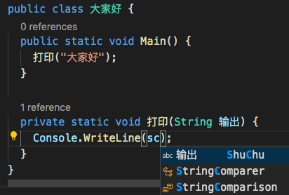
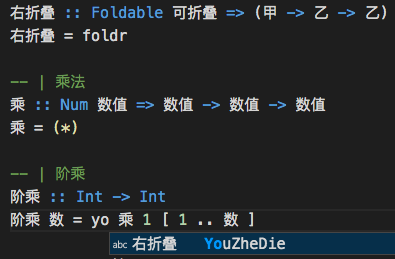
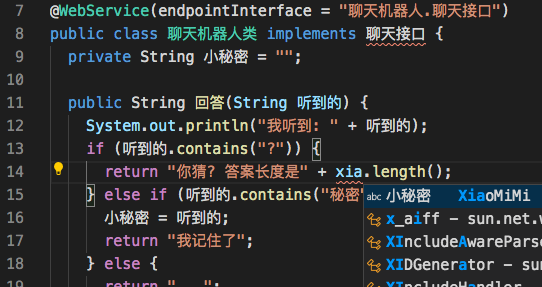
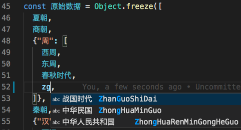
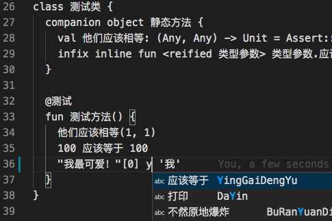
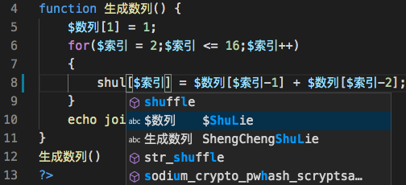
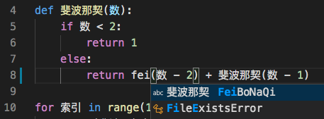
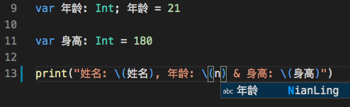

# 中文代码快速补全

支持各种编程语言，英文状态下输入拼音，匹配本行外任意位置的中文标识符。

- C#

- Haskell

- Java

- JavaScript

- Kotlin

- PHP

对 $ 开头的变量名，直接输入拼音即有提示：

- Python

- Swift

- TypeScript

## 版本说明

### 1.0.2

- 调整待选项显示：中文在前
- 改进多音字处理

### 1.0.1

“中文编程”知乎专栏文章：[中文代码快速补全 VS Code 插件尝鲜](https://zhuanlan.zhihu.com/p/138708196)

## 已知问题

暂无
